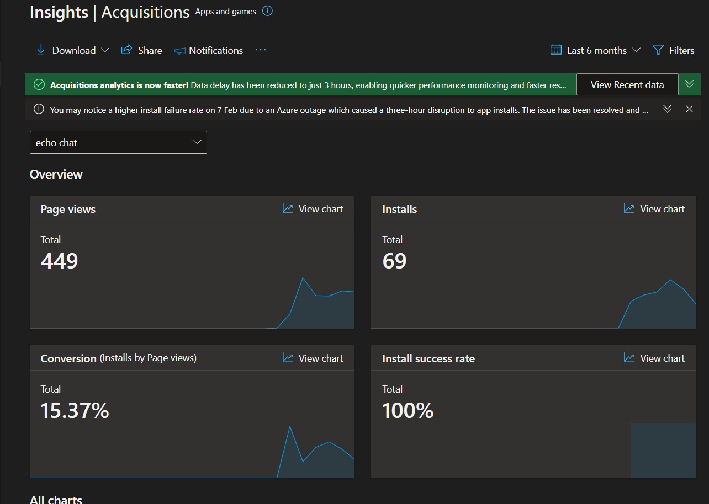
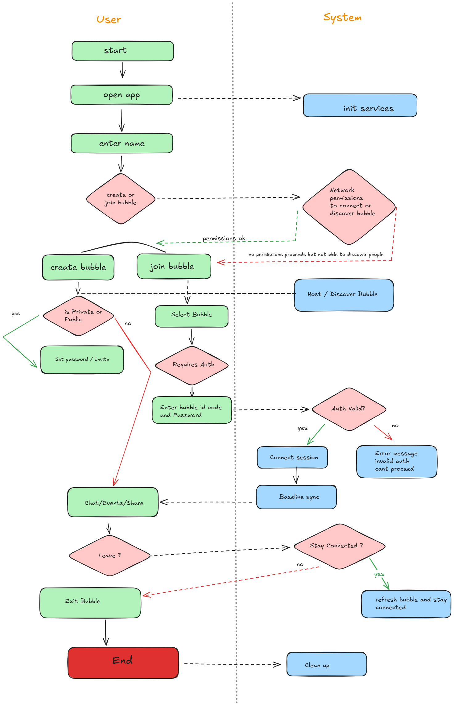

# 🚀 Echo — Real-Time LAN Communication Platform

[](https://flutter.dev)
[](https://opensource.org/licenses/MIT)
[](#-beta-metrics-testing-phase)

**Echo** is a cross-platform, real-time communication system designed for low-latency messaging over local networks (LAN). It eliminates the need for internet connectivity by turning your device into a localized communication hub.

> **Think:** WhatsApp-style communication — but fully local, instant, and infrastructure-free.

---

## 📊 Beta Metrics (Testing Phase)
*Current version: 1.0.0-beta (LAN Mode)*

| Metric | Value |
| :--- | :--- |
| **Page Views** | 449 |
| **Total Installs** | 69 |
| **Conversion Rate** | 15.37% |
| **Install Success Rate** | 100% ✅ |

**📈 Insights:**
- **Stable Builds:** 100% install success rate across Windows and Android.
- **Product Interest:** Strong conversion (~15%) indicates high market curiosity for "offline-first" solutions.


---

## 🧠 Problem Statement
Modern messaging platforms rely heavily on centralized servers and stable internet. This creates:
- ❌ **High Latency** in weak or congested networks.
- ❌ **Privacy Concerns** due to data collection and cloud storage.
- ❌ **Inaccessibility** in remote, offline, or air-gapped environments.

## 💡 The Solution
Echo introduces a **Peer-to-Host** real-time model:
- ✅ **No Internet Required:** Operates entirely on your local Wi-Fi/Ethernet.
- ✅ **Direct Device-to-Device:** Ultra-low latency via **WebSockets (TCP)**.
- ✅ **Zero Cloud Dependency:** Your data never leaves your physical location.

---

## 🏗️ Architecture Overview

Echo utilizes a distributed **Peer-to-Host** model where one device acts as the transient server.

## UML diagram 



### Key Components
1. **Client Layer (Flutter):** Handles UI rendering, user interaction, and WebSocket client logic.
2. **Embedded Server:** Runs inside the host device to manage message routing and event broadcasting.
3. **Networking Layer:** Uses WebSockets over TCP (Default Port: `4040`).

---

## ⚙️ Tech Stack

| Layer | Technology |
| :--- | :--- |
| **Frontend** | Flutter (Dart) |
| **Networking** | WebSockets (TCP) |
| **Backend** | Embedded In-App Server |
| **Platforms** | Android, Windows, iOS, macOS, Linux |

---

## ✨ Core Features
- **💬 Real-time Messaging:** Instant text transmission across the LAN.
- **🫧 Bubble-based Sessions:** Modular communication sessions for organized chats.
- **⚡ Instant Broadcasting:** Efficient event handling via `BubbleEvents`.
- **🌐 Cross-Platform:** Seamless communication between Android and Windows devices.
- **🔌 Offline-First:** Fully functional without an active ISP connection.

---

## 🔐 Security & Considerations

### Current (Beta) Status
- **Isolation:** Communication is physically limited to the local network.
- **Exposure:** No external ports are opened to the internet.

### Planned Improvements
- 🔒 **End-to-End Encryption (E2EE):** Moving from WS to WSS.
- 🔑 **Authentication Layer:** Local device pairing/handshaking.
- 🌍 **Hybrid Mode:** Secure tunneling for remote internet access.

---

## 🧪 Use Cases
- 🏫 **Classrooms:** Direct teacher-to-student local interaction.
- 🏢 **Offices:** Secure team collaboration without sensitive data leaving the building.
- 🎮 **LAN Gaming:** Integrated chat for local multiplayer setups.
- 🚨 **Emergency:** Communication in disaster zones with no cellular grid.

---

## 🛠️ Getting Started

### Prerequisites
- [Flutter SDK](https://docs.flutter.dev/get-started/install) installed.
- Both devices must be on the **same Wi-Fi network**.

### Installation
1. Clone the repository:
   ```bash
   git clone [https://github.com/simonchitepo/Echo.git](https://github.com/simonchitepo/Echo.git)